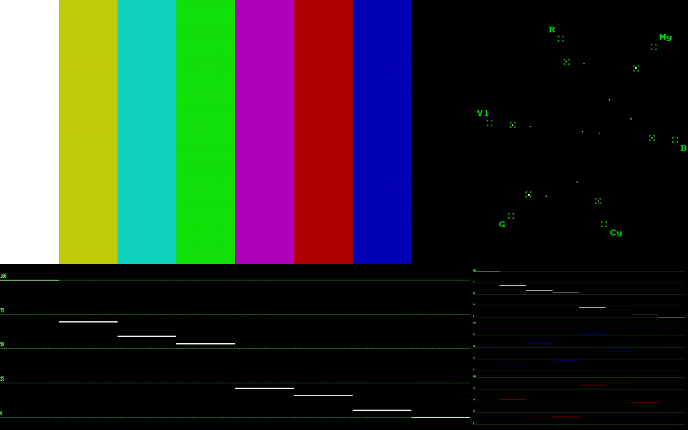

# ffmpeg-scripts

Collection of ffmpeg scripts and command lines used by us in various settings.

## ffmpeg-scope for CCU-operators
  * video input via BMD Decklink card
  * needs ffmpeg compiled with Decklink support
  * outputs fullscreen view of original video, vectorscope and waveforms (tested on debian)
  * optimized for 16:10 Monitors (1920x1200)

```
ffmpeg -format_code Hi50 -f decklink -i 'DeckLink HD Extreme 3D+' -raw_format yuv420p -vf "format=pix_fmts=yuv420p,yadif,split=4[o][v][w][p]; [o]scale=1312:736[O]; [v]vectorscope=b=1:m=gray:g=green,scale=592:592,pad=608:736:16:72[V];[w]waveform=filter=lowpass:scale=ire:graticule=green:flags=numbers+dots,scale=1312:448,pad=1312:464:0:10[W]; [p]waveform=filter=lowpass:components=7:mode=column:scale=ire:graticule=green:flags=numbers+dots:display=stack,scale=592:448,pad=608:464:8:10[P], [O][V]hstack[st], [W][P]hstack[nd], [st][nd]vstack,format=pix_fmts=yuv420p" -window_fullscreen 1 -f sdl scope
```



  * the yuv to rgb implementation in ffmpeg is not optimized and produces many late frames on our machine; a rgb waveform is possible with the following command

```
ffmpeg -format_code Hi50 -f decklink -i 'DeckLink HD Extreme 3D+' -raw_format yuv420p -vf "format=pix_fmts=yuv420p,yadif,split=4[o][v][w][p]; [o]scale=1312:736[O]; [v]vectorscope=b=1:m=gray:g=green,scale=592:592,pad=608:736:16:72[V];[w]waveform=filter=lowpass:scale=ire:graticule=green:flags=numbers+dots,scale=1312:448,pad=1312:464:0:10[W]; [p]format=gbrp,waveform=filter=lowpass:components=7:mode=column:scale=ire:graticule=green:flags=numbers+dots:display=stack,scale=592:448,pad=608:464:8:10[P], [O][V]hstack[st], [W][P]hstack[nd], [st][nd]vstack,format=pix_fmts=yuv420p" -window_fullscreen 1 -f sdl scope
```